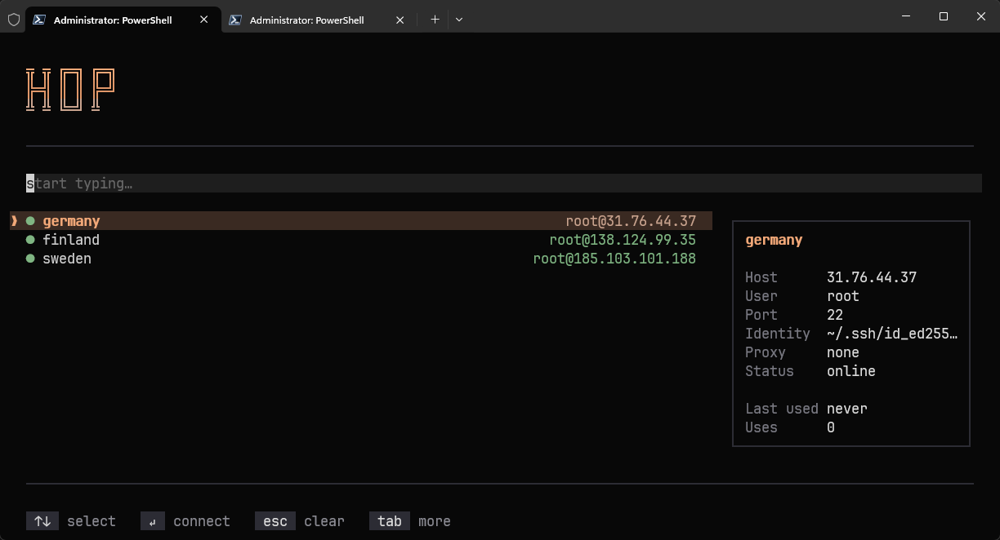

<p align="center">
  <h1 align="center">hop</h1>
  <p align="center">TUI SSH host manager — fast, keyboard-driven, lives on top of <code>~/.ssh/config</code>.</p>
</p>

<p align="center">
  <a href="https://github.com/elev1e1nSure/hop/releases"></a>
  <a href="https://github.com/elev1e1nSure/hop/releases"></a>
  
  <a href="https://goreportcard.com/report/github.com/elev1e1nSure/hop"></a>
  <a href="https://github.com/elev1e1nSure/hop/blob/main/LICENSE"></a>
</p>

<p align="center">
  
  <br>
  <sup>terminal screenshot — replace <code>screenshot.png</code> with your own</sup>
</p>

## Features

- **Fuzzy search** hosts by alias, IP, or user — start typing, results narrow instantly.
- **Full CRUD** — add, edit, delete entries directly in the TUI, no need to touch the config file.
- **Real-time status** — each host shows online/offline/proxy status.
- **Connection history** — tracks usage frequency and last connection time.
- **i18n** — English and Russian, auto-detected from locale or set via flag.
- **Zero-database** — reads and writes `~/.ssh/config` natively. Respects all existing directives (`ProxyJump`, `IdentityFile`, etc.).
- **PATH management** — `--path add` / `--path remove` to keep `hop` on your `$PATH`.

## Install

### Scoop

```powershell
scoop bucket add hop https://github.com/elev1e1nSure/hop-bucket
scoop install hop
```

Scoop adds `hop` to `PATH` automatically.

### Manual install

Download the Windows release zip from the [releases page](https://github.com/elev1e1nSure/hop/releases), unpack it, then run:

```powershell
hop --path add
```

## Usage

```bash
hop                          # launch the TUI
hop --language en            # force English
hop --language ru            # force Russian
hop --path add               # add hop to PATH
hop --path remove            # remove hop from PATH
hop --help                   # show help
```

| Key | Action |
|-----|--------|
| `↑` / `↓` | Navigate host list |
| `Enter` | Connect to selected host |
| `Ctrl+N` | Add new host |
| `Ctrl+E` | Edit selected host |
| `Ctrl+D` | Delete selected host |
| `Tab` | Toggle help panel |
| `Esc` | Clear filter |
| `Ctrl+C` | Quit |

### Refresh PATH in current PowerShell session

```powershell
$env:Path = [Environment]::GetEnvironmentVariable('Path','Machine') + ';' + [Environment]::GetEnvironmentVariable('Path','User')
```

## Powered by

- [Bubble Tea](https://github.com/charmbracelet/bubbletea) — TUI framework
- [Lip Gloss](https://github.com/charmbracelet/lipgloss) — terminal styling
- [Bubbles](https://github.com/charmbracelet/bubbles) — TUI components

## License

MIT
